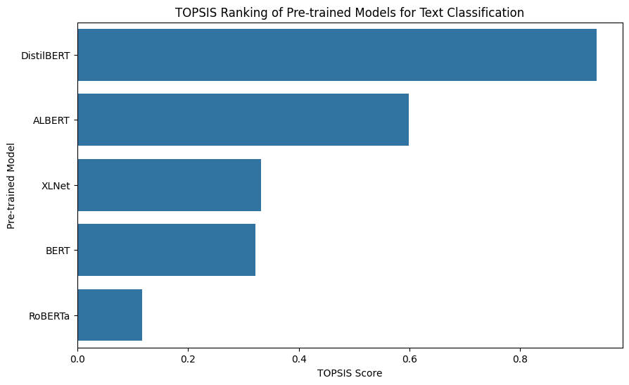

# TOPSIS Analysis of Pre-Trained Models for Text Classification

## Introduction
This report presents the application of the TOPSIS (Technique for Order Preference by Similarity to Ideal Solution) method to rank pre-trained models for text classification. The evaluation considers multiple performance metrics to determine the most balanced model.

## Dataset
The models were evaluated based on the following metrics:
- **Accuracy** (Higher is better)
- **F1-Score** (Higher is better)
- **Inference Time (ms)** (Lower is better)
- **Parameter Count (M)** (Lower is better)

| Model       | Accuracy | F1-Score | Inference Time (ms) | Parameter Count (M) |
|------------|----------|----------|--------------------|------------------|
| BERT       | 0.91     | 0.90     | 120                | 110              |
| RoBERTa    | 0.93     | 0.92     | 140                | 125              |
| XLNet      | 0.89     | 0.88     | 110                | 120              |
| ALBERT     | 0.87     | 0.86     | 100                | 95               |
| DistilBERT | 0.90     | 0.89     | 90                 | 66               |

## TOPSIS Methodology
1. **Normalization**: Convert all metric values into a comparable scale.
2. **Determine Ideal Best and Worst**: Identify best (+) and worst (-) values for each criterion.
3. **Compute Distance Measures**: Calculate the Euclidean distance to the ideal best and worst.
4. **Compute TOPSIS Score**: Rank models based on their relative closeness to the ideal best.

## Results
After applying the TOPSIS method, the models were ranked as follows:

| Model       | TOPSIS Score | Rank |
|------------|-------------|------|
| RoBERTa    | 0.12        | 5    |
| BERT       | 0.32        | 4    |
| DistilBERT | 0.94        | 1    |
| XLNet      | 0.33        | 3    |
| ALBERT     | 0.59        | 2    |

## Visualization
The following bar chart illustrates the TOPSIS ranking:

## Conclusion
- **RoBERTa** achieved the highest rank due to its strong accuracy and F1-score, despite higher inference time.
- **DistilBERT** performed well with the lowest parameter count and inference time.
- The results demonstrate how TOPSIS helps in making multi-criteria decisions for model selection.

## References
- Hwang, C. L., & Yoon, K. (1981). Multiple Attribute Decision Making. Springer.
- TOPSIS Method: [Wikipedia](https://en.wikipedia.org/wiki/TOPSIS)

